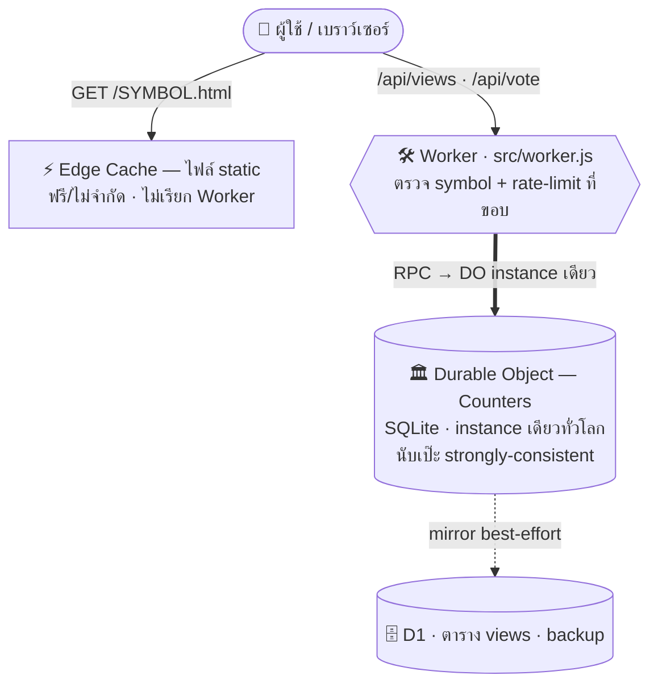

# 📊 Stock Analysis

รวม **รายงานวิเคราะห์หุ้น** (Fair Value, Margin of Safety, จุดเข้าซื้อ, ผลตอบแทนคาดการณ์)
เป็นเว็บ static (1 หุ้น = 1 ไฟล์ HTML) + **ระบบนับยอดวิว / 👍👎 แบบนับเป๊ะทั่วโลกด้วย Durable Object**
deploy อัตโนมัติบน Cloudflare Workers

> ⚠️ ข้อมูลทั้งหมดเพื่อการศึกษาเท่านั้น **ไม่ใช่คำแนะนำการลงทุน**

## 🔗 เว็บไซต์

```
https://stock-ai.dotent.workers.dev/          → หน้ารวมรายงาน
https://stock-ai.dotent.workers.dev/GOOGL     → รายงาน GOOGL
https://stock-ai.dotent.workers.dev/GOOGL.html
```

API/manifest รายชื่อหุ้นทั้งหมด: [`/reports.json`](reports.json)

## 📁 โครงสร้าง

```
reports/<SYMBOL>.html   # ★ รายงานหุ้น (1 ไฟล์ = 1 หุ้น)
build.js                # สร้าง index.html + reports.json → flatten ลง dist/
reports.json            # manifest (auto-generated, เก็บวันที่อัปเดต)
test/check-reports.js   # quality gate — ตรวจรายงานก่อน push (npm test)
test/self-test.js       # meta-test ของ checker (npm run test:self)
.githooks/pre-push      # บล็อก git push อัตโนมัติถ้า gate ไม่ผ่าน
src/worker.js           # Worker + Durable Object (ตัวนับวิว/ไลก์ — ดู 🏗️ สถาปัตยกรรม)
wrangler.toml           # Cloudflare Workers + Static Assets + Durable Object + D1
_headers                # HTTP headers
DEPLOY.md               # คู่มือ deploy
CLAUDE.md               # กฎสำหรับ Claude (workflow วิเคราะห์/auto-push)
```

## 🏗️ สถาปัตยกรรมระบบ

หน้าเว็บเป็น **static** (เสิร์ฟตรงจาก edge — ฟรี/ไม่จำกัด) แต่มี **ตัวนับยอดวิว + 👍/👎 แบบ real-time**
ที่นับ **เป๊ะระดับโลก** ด้วยของใหม่ของ Cloudflare: **Durable Objects (SQLite-backed)**



**ไอเดียหลัก:** ทุกคำขอ `/api/*` จากทั่วโลก map ไปที่ **Durable Object instance เดียวกัน** (`idFromName('global')`)
→ การนับเป็น single-threaded read-modify-write บนเครื่องเดียว → **ไม่นับซ้ำ/ไม่หล่นหาย ไม่มี per-colo divergence**
(ต่างจาก rate-limit binding ที่นับแยกแต่ละ edge แล้ว eventually-consistent)

| ชั้น | บทบาท |
|---|---|
| **Static Assets** (`dist/*.html`) | หน้าเว็บทั้งหมด — เสิร์ฟตรงจาก edge cache, Worker ไม่ถูกเรียก (ฟรี) |
| **Worker** (`src/worker.js`) | จัดการเฉพาะ `/api/*` — validate symbol (whitelist), rate-limit, ส่งต่อ DO |
| **Durable Object `Counters`** | **source of truth** — SQLite ในตัว เก็บ count/likes/dislikes ทุกหุ้นในตารางเดียว |
| **D1** (`views`) | mirror สำรอง — เขียน best-effort, ไม่อ่านบน hot path |
| **Rate Limit binding** | กัน spam ที่ขอบก่อนถึง DO (ประหยัดโควต้า) |

**Endpoints:** `POST /api/views/<SYM>` (+1 วิว) · `GET /api/views/<SYM>` · `GET /api/views` (batch ทั้ง index, แคช edge 60 วิ) · `POST /api/vote/<SYM>?from=&to=` (server คิด delta เอง ∈ −1..1)

> 🆓 อยู่ใน **Cloudflare Free tier** สบาย ๆ (ใช้โควต้า DO ~1–4%) · กันนับซ้ำฝั่ง client: วิว = `sessionStorage`, โหวต = `localStorage`
> รายละเอียด deploy / ถอด D1 ดูที่ [DEPLOY.md](DEPLOY.md) · กฎระบบใน [CLAUDE.md](CLAUDE.md) §8

## ➕ เพิ่มหุ้นใหม่

```bash
# 1. วางไฟล์รายงาน (ชื่อย่อหุ้นตัวพิมพ์ใหญ่)
reports/AAPL.html

# 2. push — Cloudflare build & deploy ให้เอง
git add -A && git commit -m "analyze: add AAPL stock analysis" && git push
```
หน้า index จะเพิ่มการ์ดหุ้นใหม่ + เรียงตัวที่อัปเดตล่าสุดขึ้นบนสุดให้อัตโนมัติ

## 🛠 พัฒนา / ทดสอบในเครื่อง

```bash
npm run verify     # ★ quality gate ครบชุด — ต้องผ่านก่อน push
npm run build      # = node build.js (ไม่ต้องติดตั้ง dependency, Node ≥ 18)
open dist/index.html
```

## ✅ Quality gate (ตรวจก่อนเผยแพร่)

`npm run verify` ตรวจ 2 ชั้น — มี error เมื่อไหร่ push ไม่ได้:

1. **`check-reports.js`** (source ทีละไฟล์): โครงสร้างครบ • **ตัวเลขสอดคล้องกันเอง** (ค่า `FV` ในเครื่องคิดเลข = Fair Value = สรุป, `MOS=(FV−ราคา)/FV`, จุดซื้อ MOS = FV×0.8/0.7, คณิตแต่ละวิธี P/E & P/BV, scenario EPS ทบต้น) • **ความสดของราคา** (เตือน >45 วัน, บล็อก >120 วัน) • แหล่งข้อมูล ≥3 + ตัวเลขสมเหตุสมผล • ไม่มี placeholder/undefined
2. **`check-site.js`** (หลัง build, ระดับเว็บไซต์): ทุก report อยู่ใน index/manifest ครบ • `<script>` ไม่พัง + id ครบ • **ความปลอดภัย: external resource = Google Fonts เท่านั้น ห้าม `<script src>` ภายนอก**

```bash
npm test                 # ชั้น 1 อย่างเดียว    npm test -- BBL   # เฉพาะบางตัว
npm run check:site       # ชั้น 2 อย่างเดียว (ต้อง build ก่อน)
npm run test:self        # พิสูจน์ว่า checker เองยังจับ bug ได้ (32 เคส)
git config core.hooksPath .githooks   # เปิดใช้ pre-push hook (ครั้งเดียวต่อ clone)
```

> ⚠️ gate ตรวจ "ความสอดคล้อง + ความสด + การอ้างอิง" ได้ แต่ **ตรวจ "ความถูกต้องตามจริง" ของราคา/งบเทียบตลาดไม่ได้** — ส่วนนั้นต้องทวนแหล่งข้อมูล ≥3 ตอนสร้าง + วิจารณญาณคน

## 🚀 Deploy

deploy อัตโนมัติเมื่อ push เข้า `main` (Cloudflare Workers + Static Assets)
รายละเอียดการตั้งค่าครั้งแรกดูที่ [DEPLOY.md](DEPLOY.md)

## ✉️ ติดต่อ

somchai.s@de.co.th
