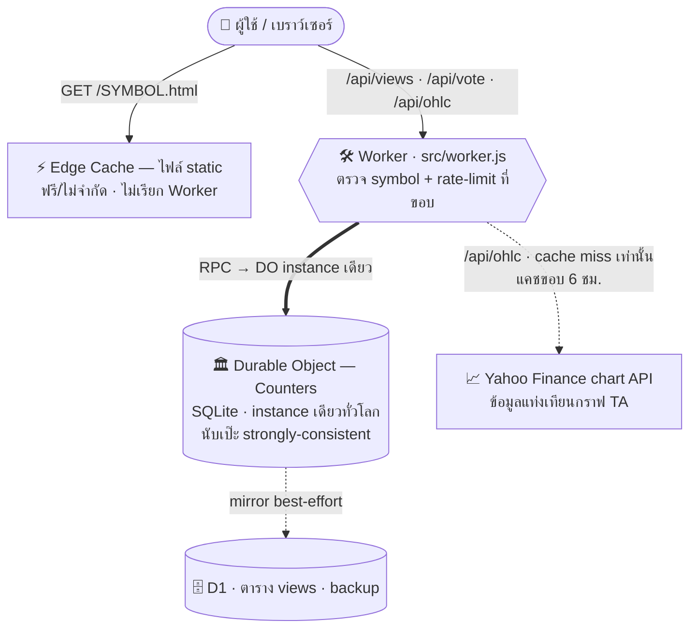

# 📊 Stock Analysis

รวม **รายงานวิเคราะห์หุ้น** (Fair Value, Margin of Safety, จุดเข้าซื้อ, ผลตอบแทนคาดการณ์)
เป็นเว็บ static (1 หุ้น = 1 ไฟล์ HTML) + **screener เรียง/คัดกรองด้วย MOS · P/E · Yield · ROE · Upside** (เรียงฝั่ง client, 0 request)
\+ **ป้ายไฮไลต์ "จุดเด่น" อัตโนมัติต่อหุ้น** (เลือก metric ที่เด่นสุด + มงกุฎให้ตัวที่ดีสุดในกลุ่ม — คำนวณตอน build)
\+ **รายงานแบบ content-only template** (โครง CSS/กราฟใช้ร่วมใน `_template/` inject ตอน build — เล็กลง ~45%) + **สีแบรนด์เฉพาะตัวทุกหุ้น** (เลือกตามลักษณะหุ้น)
\+ **GUI แบบ brand-forward** (ส.ค. 2569 — ดู [DESIGN.md](DESIGN.md)): สีแบรนด์คุมทั้งหน้ารายงานผ่านโทเคนสีที่ derive ตอน build · หน้าแรกไทล์สี ⇄ ตาราง (สลับได้, เรียงจากหัวคอลัมน์ได้) · การ์ดสถิติบน header เป็นปุ่มกรองตลาดในตัว · การ์ดสถิติหน้ารายงาน (👁 วิว + 👍/👎 กดโหวตได้ + อัปเดตแบบ "1d ago") · section nav sticky + scroll-spy
\+ **กราฟ TA แบบ TradingView** (แท่งเทียน + volume + EMA 7/30/200 + RSI + เส้น FV/MOS · toolbar เปลี่ยน TF/ซูม/log scale/บันทึกรูป — inject ตอน build ไม่แตะไฟล์รายงาน)
\+ **ราคา + กราฟ + วันที่ราคา อัปเดตอัตโนมัติทุกวัน** (GitHub Actions cron — script deterministic ไม่มี LLM · ตัวที่ขยับแรงเข้าคิว re-analysis)
\+ **ระบบนับยอดวิว / 👍👎 แบบนับเป๊ะทั่วโลกด้วย Durable Object** — deploy อัตโนมัติบน Cloudflare Workers

> ⚠️ ข้อมูลทั้งหมดเพื่อการศึกษาเท่านั้น **ไม่ใช่คำแนะนำการลงทุน**

## 🔗 เว็บไซต์

```
https://stock-ai.dotent.workers.dev/          → หน้ารวมรายงาน
https://stock-ai.dotent.workers.dev/GOOGL     → รายงาน GOOGL
https://stock-ai.dotent.workers.dev/GOOGL.html
```

API/manifest รายชื่อหุ้นทั้งหมด: [`/reports.json`](reports.json)

## 📁 โครงสร้าง

```
reports/<SYMBOL>.html   # ★ รายงานหุ้น content-only (เนื้อหา + report-data: ตัวเลขกราฟ/gauge + ธีมสีแบรนด์)
_template/              # โครงใช้ร่วม: dashboard.css + engine.js + skeleton-{th,us}.html (จุดตั้งต้นรายงานใหม่) + agent-prompt.md
_template/ta-*.js vendor/  # กราฟ TA: ta-engine.js (คำนวณล้วน) + ta-chart.js (glue) + lightweight-charts v5.2.0 (Apache-2.0, vendor ไม่พึ่ง CDN)
build.js                # expandReport (ขยาย template) + injectTA + inject section nav/การ์ดสถิติ header + สร้าง index.html + reports.json → flatten ลง dist/
DESIGN.md               # ระบบดีไซน์ GUI: ฟอนต์/สถาปัตยกรรมสี brand-forward/องค์ประกอบหน้าแรก-หน้ารายงาน/กติกา mobile
reports.json            # manifest (auto-generated — track วันที่วิเคราะห์/hash) ห้ามแก้มือ
price-flags.json        # คิวหุ้นรอ re-analysis จาก cron ราคา (snapshot ต่อรอบ — จัดการอัตโนมัติ)
tools/                  # prep-stock.js (pre-fetch pack + CROSS-VERIFY) · fetch-facts.js · fetch-fundamentals.js · update-prices.js (cron ราคา)
                        #   · pick-brand.js + brandtheme.js + seeds.json + brand-colors.md · preserve-dates.js · migrate.js · symbol-map.json (ticker เปลี่ยนชื่อ)
test/                   # quality gate ทุกชั้น: update-prices-test · dead-ticker-test · check-reports · ohlc-test · ta-engine-test · build-test · engine-exec · skeleton-test · check-site
                        #   + นอก gate: self-test · prep-stock-test
docs/                   # รายละเอียดเชิงลึก: quality-gate.md · templates.md · counters.md · price-refresh.md · ta-chart.md · orchestration.md
.github/workflows/update-prices.yml        # cron อัปเดตราคาทุกวัน 07:17 น. ไทย
.github/workflows/fundamentals-canary.yml  # canary รายสัปดาห์ (จันทร์ 09:00 น. ไทย) — จับแหล่งข้อมูลเปลี่ยนโครง
.githooks/pre-push      # บล็อก git push อัตโนมัติถ้า gate ไม่ผ่าน
src/worker.js src/ohlc.js  # Worker + Durable Object (ตัวนับวิว/ไลก์) + route /api/ohlc (ข้อมูลกราฟ TA) — ดู 🏗️ สถาปัตยกรรม
static/                 # og.png / og.svg (การ์ดพรีวิวตอนแชร์ลิงก์)
wrangler.toml _headers  # Cloudflare Workers + Static Assets + Durable Object + D1 / HTTP headers
DEPLOY.md               # คู่มือ deploy
CLAUDE.md               # กฎสำหรับ Claude (workflow วิเคราะห์ / auto-push / cron ราคา §9 / template+สี+TA §10)
```

## 🏗️ สถาปัตยกรรมระบบ

หน้าเว็บเป็น **static** (เสิร์ฟตรงจาก edge — ฟรี/ไม่จำกัด) แต่มี **ตัวนับยอดวิว + 👍/👎 แบบ real-time**
ที่นับ **เป๊ะระดับโลก** ด้วยของใหม่ของ Cloudflare: **Durable Objects (SQLite-backed)**


```mermaid
flowchart TD
    U(["👤 ผู้ใช้ / เบราว์เซอร์"])
    U -->|"GET /SYMBOL.html"| CACHE["⚡ Edge Cache — ไฟล์ static<br/>ฟรี/ไม่จำกัด · ไม่เรียก Worker"]
    U -->|"/api/views · /api/vote · /api/ohlc"| W{{"🛠️ Worker · src/worker.js<br/>ตรวจ symbol + rate-limit ที่ขอบ"}}
    W ==>|"RPC → DO instance เดียว"| DO[("🏛️ Durable Object — Counters<br/>SQLite · instance เดียวทั่วโลก<br/>นับเป๊ะ strongly-consistent")]
    DO -.->|"mirror best-effort"| D1[("🗄️ D1 · ตาราง views · backup")]
    W -.->|"/api/ohlc · cache miss เท่านั้น<br/>แคชขอบ 6 ชม."| Y["📈 Yahoo Finance chart API<br/>ข้อมูลแท่งเทียนกราฟ TA"]
```

**ไอเดียหลัก:** ทุกคำขอ `/api/*` จากทั่วโลก map ไปที่ **Durable Object instance เดียวกัน** (`idFromName('global')`)
→ การนับเป็น single-threaded read-modify-write บนเครื่องเดียว → **ไม่นับซ้ำ/ไม่หล่นหาย ไม่มี per-colo divergence**
(ต่างจาก rate-limit binding ที่นับแยกแต่ละ edge แล้ว eventually-consistent)

| ชั้น | บทบาท |
|---|---|
| **Static Assets** (`dist/*.html`) | หน้าเว็บทั้งหมด — เสิร์ฟตรงจาก edge cache, Worker ไม่ถูกเรียก (ฟรี) |
| **Worker** (`src/worker.js`) | จัดการเฉพาะ `/api/*` — validate symbol (whitelist), rate-limit, ส่งต่อ DO |
| **`/api/ohlc/<SYM>`** | proxy Yahoo (3 ปี รายวัน) ให้กราฟ TA — เช็ค Cache API ก่อนเสมอ, cache miss ถึงกินโควตา (20 req/60 วิ), แคชขอบ 6 ชม. |
| **Durable Object `Counters`** | **source of truth** — SQLite ในตัว เก็บ count/likes/dislikes ทุกหุ้นในตารางเดียว |
| **D1** (`views`) | mirror สำรอง — เขียน best-effort, ไม่อ่านบน hot path |
| **Rate Limit binding** | กัน spam ที่ขอบก่อนถึง DO (ประหยัดโควต้า) |
| **กันบอต** (`countable()`) | นับเฉพาะคำขอจากหน้าเว็บเราเอง (`Origin`/`Sec-Fetch`) + UA ไม่ใช่บอต — บอต/ยิง API ตรง ไม่ถูกนับ |

**Endpoints:** `POST /api/views/<SYM>` (+1 วิว) · `GET /api/views/<SYM>` · `GET /api/views` (batch ทั้ง index, แคช edge 60 วิ) · `POST /api/vote/<SYM>?from=&to=` (server คิด delta เอง ∈ −1..1) · `GET /api/ohlc/<SYM>?cur=USD|THB&tf=D|H` (ข้อมูลแท่งเทียนกราฟ TA)

> 🆓 อยู่ใน **Cloudflare Free tier** สบาย ๆ (ใช้โควต้า DO ~1–4%) · กันนับซ้ำฝั่ง client: วิว = `sessionStorage`, โหวต = `localStorage`
> รายละเอียด deploy / ถอด D1 ดูที่ [DEPLOY.md](DEPLOY.md) · โครงสร้างระบบนับดูที่ [`docs/counters.md`](docs/counters.md)

### 📈 กราฟ TA (TradingView-style)

กราฟ SVG เดิมใน section 2 ถูกยกระดับเป็น **แท่งเทียน + volume + EMA 7/30/200 + RSI14 + เส้น FV / MOS 20% / MOS 30%**
โครงสร้างราคา (BOS · CHoCH · divergence) สรุปเป็น chips ใต้กราฟ · **toolbar โต้ตอบได้**: TF 1H/4H/D/W ·
range 1M–3Y (default 6M) · ซูม/รีเซ็ต/log scale · toggle เส้นแต่ละเส้น · บันทึกรูป PNG

- **ไม่แตะไฟล์รายงานแม้แต่ไฟล์เดียว** — `build.js` (`injectTA`) ต่อท้าย `dist/<SYM>.html` เฉพาะตอน build:
  `window.__TA_CFG__` + `<script src="/assets/ta-<hash>.js">` (bundle เดียว shared ทั้งเว็บ, immutable cache)
- **progressive enhancement** — โหลดเมื่อกราฟใกล้เข้าจอ (`IntersectionObserver`) แล้ว swap ทีเดียว · โหลด/คำนวณพลาด = คงกราฟ SVG เดิมไว้ ผู้ใช้ไม่มีทางเห็นพัง
- **คำนวณ TA ฝั่ง client ทั้งหมด** (`ta-engine.js` เป็น pure function ตรึงนิยามด้วย `test/ta-engine-test.js`) · chips สัญญาณคิดจากรายวันเสมอ ไม่แกว่งตาม TF ที่กดเล่น

> สถาปัตยกรรมเต็ม + นิยาม TA ทุกตัว: [`docs/ta-chart.md`](docs/ta-chart.md)

## ➕ เพิ่มหุ้นใหม่

```bash
# 1. ก๊อปโครงต้นแบบให้ตรงตลาด (ห้ามก๊อปรายงานเก่า — เลขเดิมจะติดมา)
cp _template/skeleton-us.html reports/AAPL.html    # หุ้นต่างประเทศ ($ · NASDAQ/NYSE)
cp _template/skeleton-th.html reports/HMPRO.html   # หุ้นไทย (฿ · SET)

# 2. ดึงข้อมูลตั้งต้นครบใน 1 คำสั่ง (ราคา+กราฟ 13 จุด+ป้าย % รอบปี+สี · งบ 5 ปี · CROSS-VERIFY ราคา/EPS 2 แหล่ง)
node tools/prep-stock.js AAPL           # หุ้นไทยเติม --th · อัปเดตหุ้นเดิมเติม --update
#    ↳ exit 2 = ราคาสองแหล่งต่างกัน >5% → หยุด อย่าเผยแพร่ (gate ตรวจ "ความจริง" ของราคาแทนคนไม่ได้)
#    (เอาเฉพาะราคา/กราฟ: node tools/fetch-facts.js AAPL · เอาเฉพาะงบ: node tools/fetch-fundamentals.js AAPL)

# 3. แทนทุก {{TOKEN}} ด้วยข้อมูลจริง (gate E13 จะ error ถ้าเหลือ {{...}} ค้าง)
#    เลือกสีแบรนด์ใน report-data.theme (ดู tools/brand-colors.md · ช่วยเลือก: node tools/pick-brand.js AAPL --auto)
#    + ให้ตัวเลขสอดคล้องกัน (docs/quality-gate.md)

# 3b. อัปเดตหุ้นเดิม → ไม่ต้องเริ่ม skeleton ใหม่: แก้ไฟล์เดิมเฉพาะจุด (EPS/FV/prose/วันที่วิเคราะห์)
#     แล้ว node tools/update-prices.js --write --force AAPL patch ราคา/กราฟ/MOS ให้อัตโนมัติ

# 4. push — Cloudflare build & deploy ให้เอง
npm run verify && git add -A && git commit -m "analyze: add AAPL stock analysis" && git pull --rebase origin main && git push origin HEAD:main
```
หน้า index จะเพิ่มการ์ดหุ้นใหม่ + เรียงตัวที่อัปเดตล่าสุดขึ้นบนสุดให้อัตโนมัติ

> **โครงต้นแบบ** `_template/skeleton-{th,us}.html` คือจุดตั้งต้นที่สะอาด (ไม่มีตัวเลขหุ้นเก่าติดมา) — มีครบ 8 section,
> marker, บล็อก `stock-meta`/`report-data`, comment กำกับทุกช่อง · เติมแล้ว **การันตีผ่าน gate** (มี `test/skeleton-test.js` คุม) ·
> **ปรับ metric/วิธี valuation ตามเซกเตอร์ได้อิสระ** (โครงเป็นแค่ตัวอย่าง — ธนาคารใช้ NIM/NPL, REIT ใช้ Occupancy/DPU, หุ้นขาดทุนตัด P/E ออก; gate ไม่บังคับชุด metric, cross-check เฉพาะ P/E·P/BV·ปันผล·ROE = warning) ·
> ระบบ template + หลักเลือกสีแบรนด์: [`docs/templates.md`](docs/templates.md) + [`tools/brand-colors.md`](tools/brand-colors.md) ·
> **ป้าย % หลังราคา (header) ต้องเป็นผลตอบแทน "รอบปี"** (`▲ +X.X% (รอบปี)` · IPO ใหม่ใช้ `(ตั้งแต่ IPO)`) = ผลตอบแทนปลายกราฟ section 2 ที่ต้องเป็น **ราคาย้อนหลัง ~1 ปี (≤13 จุด)** — gate E34–E37 บังคับ ·
> ไฟล์ HTML เต็มแบบเก่าก็ยังใช้ได้ (`expandReport` ปล่อยผ่าน) แปลงเป็น template ด้วย `node tools/migrate.js <SYM> --write`

## 🔄 อัปเดตราคาอัตโนมัติทุกวัน (cron)

GitHub Actions ([`update-prices.yml`](.github/workflows/update-prices.yml)) รันทุกวัน **07:17 น. ไทย** — ดึงราคาจริงจาก Yahoo
(ยิงเดียวต่อหุ้น: `?range=1y&interval=1mo`) แล้ว patch **เฉพาะตัวเลขโครงสร้าง** ลงทุกรายงาน:
ราคา header + วันที่ราคา + กราฟ 13 จุด (~1 ปี) + ป้าย % รอบปี + เข็ม gauge + MOS + เครื่องคิดเลข + `stock-meta`
→ ผ่าน `npm run verify` ครบทุกขั้นแล้วจึง commit + push เอง (Cloudflare deploy ต่อ)

- **script deterministic ล้วน ไม่มี LLM ในลูป** ([`tools/update-prices.js`](tools/update-prices.js)) · **ไม่แตะ** prose วิเคราะห์ / EPS / Fair Value / วันที่วิเคราะห์ (ลำดับ index ยังเรียงตามวันวิเคราะห์ — `preserve-dates.js` คืนให้)
- ตัวที่ขยับแรงจนคำวิเคราะห์เดิมผิดความหมาย (ต่าง **>15%** · **MOS พลิกเครื่องหมายเกิน dead-band ±3 จุด** · สงสัย split **>25%**) → **ไฟล์ไม่ถูกแตะ** แต่เข้าคิว [`price-flags.json`](price-flags.json) + GitHub Issue เดียวรอ **re-analysis** (flag หายเองเมื่อรายงานสดแล้ว)
- ตรงข้าม — เคสที่ **ไม่** freeze แล้ว: MOS พลิกอยู่ใน ±3 จุด = patch ผ่านปกติ · ราคาหลุดขอบ gauge = **ขยายขอบให้เอง** (auto-rescale) — สองข้อนี้ตัด noise ในคิวไป ~80%
- ticker เปลี่ยนชื่อ (เช่น BKI→BKIH) ประกาศใน [`tools/symbol-map.json`](tools/symbol-map.json) — ใช้ร่วมกันทั้ง cron ราคาและ `/api/ohlc`
- log ต่อหุ้น (`AAPL 297.21 → 315.32 (+6.1%)` + บรรทัด freeze) เก็บถาวรใน commit body — ดูย้อนหลัง: `git log --grep "price: refresh"`

```bash
node tools/update-prices.js AAPL           # dry-run ตัวเดียว (โชว์ว่าจะเปลี่ยนอะไร ไม่เขียนไฟล์)
node tools/update-prices.js --write AAPL   # เขียนจริง → ตามด้วย build + preserve-dates + build + verify
npm run test:prices                        # unit test offline (fixture + mock Yahoo)
```

> กลไกเต็ม / กติกา freeze / วิธี debug: [`docs/price-refresh.md`](docs/price-refresh.md)

**canary รายสัปดาห์** ([`fundamentals-canary.yml`](.github/workflows/fundamentals-canary.yml) — จันทร์ 09:00 น. ไทย) ยิง `fetch-fundamentals`
จริงแล้วเช็คว่ายังได้ราคา + บรรทัด Δ + ตารางงบครบแถว · ล้ม → เปิด GitHub Issue ทันที
มีไว้เพราะแหล่งข้อมูลเคย **degrade เงียบ** (2 ส.ค. 2569: StockAnalysis ย้าย `/financials/` เป็นหน้าว่าง) แล้วไปพังกลางเวฟวิเคราะห์

## 🛠 พัฒนา / ทดสอบในเครื่อง

```bash
npm run verify     # ★ quality gate ครบชุด — ต้องผ่านก่อน push
npm run build      # = node build.js (ไม่ต้องติดตั้ง dependency, Node ≥ 20.19)
open dist/index.html   # ดูหน้าเว็บ static — แต่ /api/* ไม่ทำงาน (ตัวนับ = 0, กราฟ TA คงเป็น SVG เดิม)
npm run dev        # = wrangler dev — ต้องใช้ตัวนี้ถ้าจะทดสอบตัวนับวิว/โหวต หรือกราฟ TA จริง
```

## ✅ Quality gate (ตรวจก่อนเผยแพร่)

`npm run verify` ตรวจ 10 ขั้นตามลำดับนี้ — มี error เมื่อไหร่ push ไม่ได้:

1. **`update-prices-test.js`** (unit-test cron ราคา, offline): `decide` freeze/patch • `detectStaleQuotes`/`capByCohort`/`unverifiedCohorts` (ยืนยันหุ้นตายสองชั้น) • `mergeFlags` • `patchReport` • `commitBody`
2. **`dead-ticker-test.js`** (unit-test canary หุ้นตาย, offline): `tvBaseName`/`tvCandidates` (symbol-map + หุ้นสองคลาส) • `parseRows`/`classify` • `mergeDeadFlags` • `shouldAbort` • retry ตอน scanner สะอึก
3. **`check-reports.js`** (source ทีละไฟล์ — 38 error + 11 warning): โครงสร้างครบ (รวม meta `ai-model` ระบุโมเดล AI) • **ตัวเลขสอดคล้องกันเอง** (ค่า `FV` ในเครื่องคิดเลข = Fair Value = สรุป, `MOS=(FV−ราคา)/FV`, จุดซื้อ MOS = FV×0.8/0.7, คณิตแต่ละวิธี P/E & P/BV, scenario EPS ทบต้น) • **บล็อก `stock-meta` (screener) = เลขที่โชว์จริง** (E29–31) • **CSS var ครบ (E33)** • **ป้าย % รอบปี + กราฟ ~1 ปี** (header `.chg` = ผลตอบแทน "รอบปี" = ปลายกราฟ section 2 · สี↔ทิศ · กราฟ ≤13 จุด · E34–E37) • **contrast ธีมอ่านออกทุกคู่สี — WCAG AA** (ตัวหนังสือ ≥4.5 · เส้นกราฟ ≥3 · E38) • **ความสดของราคา** (เตือน >45 วัน, บล็อก >120 วัน) • ไม่มี placeholder/`{{token}}` ค้าง
4. **`ohlc-test.js`**: `src/ohlc.js` แปลง Yahoo JSON → payload แท่งเทียนถูกต้อง (ตัดแท่ง null, ปัดทศนิยม)
5. **`ta-engine-test.js`**: ตรึงนิยาม TA ด้วย fixture — `ema` · `rsi` · `findPivots` · `labelStructure` · `detectBreaks` (ห้าม look-ahead) · `detectDivergence` · `summarizeSignals`
6. **`build`**: expand ทุก report + `injectTA` + สร้าง index/manifest ลง `dist/` ต้องไม่พัง
7. **`build-test.js`** (unit-test build.js): `freshHash` • เครดิตโมเดล AI ต่อ report • `extractMetrics`/`pickHighlight`/`computeLeaders` • `injectTA` • **`validateReportData`** กัน render พังเงียบ (gridFmt/dataFmt ตรง scope, bounds ไม่ degenerate, fv>0, ค่าสี theme ถูกต้อง/ไม่ inject)
8. **`engine-exec.js`** (รัน engine ทุกรายงานใน mock DOM): กราฟ (`<path>`+`<circle>`), เข็ม gauge, เครื่องคิดเลข MOS ต้อง render จริง **ไม่ throw + ไม่มีพิกัด NaN/Infinity** — ปิดช่อง "syntax ผ่านแต่ runtime พัง"
9. **`skeleton-test.js`**: โครงต้นแบบ TH/US เติมข้อมูลจริง (ไทย = HMPRO) แล้วต้องผ่าน gate + engine รันได้
10. **`check-site.js`** (หลัง build, ระดับเว็บไซต์): ทุก report อยู่ใน index/manifest ครบ • `<script>` JS ไม่พัง + id ครบ • โมเดลใน footer = meta `ai-model` • **การ์ด index `data-*` = บล็อก stock-meta** • **ความปลอดภัย: external resource = Google Fonts เท่านั้น ห้าม `<script src>` ภายนอก**

```bash
npm test                 # ชั้น 1 อย่างเดียว    npm test -- BBL   # เฉพาะบางตัว
npm run test:ohlc        # แปลง Yahoo OHLC (ชั้น 2)
npm run test:ta          # นิยาม TA engine (ชั้น 3)
npm run test:build       # unit-test build.js (expandReport/validate/injectTA/deriveTheme/section nav — 102 เคส)
npm run test:engine      # รัน engine ใน mock DOM    test:engine -- BBL = เฉพาะตัว
npm run test:skeleton    # โครงต้นแบบ TH/US เติมแล้วผ่าน gate
npm run check:site       # ระดับเว็บไซต์ (ต้อง build ก่อน)
# --- นอก verify (รันเองเมื่อแตะส่วนนั้น) ---
npm run test:prices      # unit test ตัวอัปเดตราคา (offline)
npm run test:prep        # prep-stock: CROSS-VERIFY verdict + exit code
npm run test:self        # พิสูจน์ว่า checker เองยังจับ bug ได้
git config core.hooksPath .githooks   # เปิดใช้ pre-push hook (ครั้งเดียวต่อ clone)
```

> ⚠️ gate ตรวจ "ความสอดคล้อง + ความสด + การอ้างอิง" ได้ แต่ **ตรวจ "ความถูกต้องตามจริง" ของราคา/งบเทียบตลาดไม่ได้** — ส่วนนั้นต้อง cross-source verify ≥2 แหล่งตอนสร้าง + วิจารณญาณคน

> รายละเอียดทุกชั้น / ทุก E-code + env threshold: [`docs/quality-gate.md`](docs/quality-gate.md)

## 🚀 Deploy

deploy อัตโนมัติเมื่อ push เข้า `main` (Cloudflare Workers + Static Assets)
รายละเอียดการตั้งค่าครั้งแรกดูที่ [DEPLOY.md](DEPLOY.md)

## ✉️ ติดต่อ

somchai.s@de.co.th
