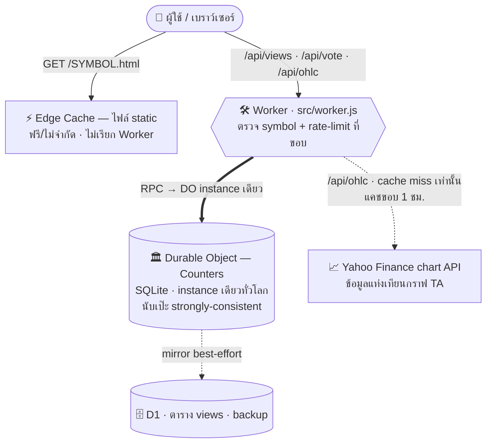

# 📊 Stock Analysis

รวม **รายงานวิเคราะห์หุ้น** (Fair Value, Margin of Safety, จุดเข้าซื้อ, ผลตอบแทนคาดการณ์)
เป็นเว็บ static (1 หุ้น = 1 ไฟล์ HTML) + **screener เรียง/คัดกรองด้วย MOS · P/E · Yield · ROE · Upside** (เรียงฝั่ง client, 0 request)
\+ **ป้ายไฮไลต์ "จุดเด่น" อัตโนมัติต่อหุ้น** (เลือก metric ที่เด่นสุด + มงกุฎให้ตัวที่ดีสุดในกลุ่ม — คำนวณตอน build)
\+ **รายงานแบบ content-only template** (โครง CSS/กราฟใช้ร่วมใน `_template/` inject ตอน build — เล็กลง ~45%) + **สีแบรนด์เฉพาะตัวทุกหุ้น** (เลือกตามลักษณะหุ้น)
\+ **GUI แบบ brand-forward** (ส.ค. 2569 — ดู [DESIGN.md](DESIGN.md)): สีแบรนด์คุมทั้งหน้ารายงานผ่านโทเคนสีที่ derive ตอน build · หน้าแรกไทล์สี ⇄ ตาราง (สลับได้, เรียงจากหัวคอลัมน์ได้) · การ์ดสถิติบน header เป็นปุ่มกรองตลาดในตัว · การ์ดสถิติหน้ารายงาน (👁 วิว + 👍/👎 กดโหวตได้ + อัปเดตแบบ "1d ago") · section nav sticky + scroll-spy
\+ **กราฟ TA แบบ TradingView** (แท่งเทียน + volume + EMA 7/30/200 + RSI + เส้น FV/MOS · toolbar เปลี่ยน TF/ซูม/log scale/บันทึกรูป — inject ตอน build ไม่แตะไฟล์รายงาน)
\+ **ราคา + กราฟ + วันที่ราคา อัปเดตอัตโนมัติทุกวัน** (GitHub Actions cron — script deterministic ไม่มี LLM · ตัวที่ขยับแรงเข้าคิว re-analysis)
\+ **ระบบนับยอดวิว / 👍👎 แบบนับเป๊ะทั่วโลกด้วย Durable Object** — deploy อัตโนมัติบน Cloudflare Workers

> ⚠️ ข้อมูลทั้งหมดเพื่อการศึกษาเท่านั้น **ไม่ใช่คำแนะนำการลงทุน**

## 🔗 เว็บไซต์

```
https://gaohoon.com/          → หน้ารวมรายงาน
https://gaohoon.com/GOOGL     → รายงาน GOOGL
https://gaohoon.com/GOOGL.html
```

API/manifest รายชื่อหุ้นทั้งหมด: [`/reports.json`](reports.json)

## 📁 โครงสร้าง

จัดกลุ่มตามหน้าที่ ไม่ใช่รายชื่อครบทุกไฟล์

```
# ── ข้อมูล ──
reports/<SYMBOL>.html   # ★ ต้นฉบับรายงาน 1 ไฟล์ = 1 หุ้น (พิมพ์ใหญ่) — content-only: เนื้อหา 8 section + report-data (กราฟ/gauge/ธีม)
reports.json            # manifest (build เขียนเอง — วันที่วิเคราะห์/freshHash) ห้ามแก้มือ · price-flags.json = คิวหุ้นรอ re-analysis จาก cron ราคา
tags.json               # แท็กธีม symbol → slug — tools/tag-apply.js เป็นทางเข้าเดียวที่เขียน · tags-vocab.json = คลังคำที่อนุมัติ

# ── โครงใช้ร่วม: inject ตอน build ไม่แตะไฟล์รายงาน ──
_template/              # skeleton-{th,us}.html = จุดตั้งต้นรายงานใหม่ · dashboard.css · fonts.css · engine.js · agent-prompt.md (prompt แม่แบบ worker)
                        #   ta-engine.js (คำนวณ TA) + ta-chart.js (glue) · vendor/ = lightweight-charts v5.2.0 (Apache-2.0, ไม่พึ่ง CDN)
fonts/ static/          # Sarabun + IBM Plex Mono self-host (+OFL) / og.png · og.svg (พรีวิวตอนแชร์ลิงก์)

# ── build + runtime ──
build.js                # expandReport + injectTA + section nav/การ์ดสถิติ header + index.html + reports.json → flatten ลง dist/ (⚠️ dist/ = gitignore ห้ามแก้มือ)
src/worker.js src/ohlc.js     # Worker (route /api/* + rate-limit + Durable Object ตัวนับ) / Yahoo chart JSON → แท่งเทียน
wrangler.toml _headers schema.sql migrate-votes.sql   # Cloudflare Workers + Static Assets + DO / HTTP headers / ตาราง D1 + migration โหวต

# ── tools/ = CLI + library ของเครื่องมือทั้งหมด ──
prep-stock.js     # pre-fetch + CROSS-VERIFY ราคา/EPS 2 แหล่ง (exit 2 = ขัดกัน หยุด) · fetch-facts.js · fetch-fundamentals.js · median-multiples.js · earnings-calendar.js
update-prices.js  # cron ราคา (patch + freeze) · preserve-dates.js · price-date.js · dead-ticker-canary.js · flags-issue-body.js
queue.js + queue/ # runbook เคลียร์คิว price-flags — คำสั่ง: preflight · prep · postcheck · ship · status (โมดูลใน queue/: triage · state · market · footer-date)
report-meta.js    # เจ้าของ regex ของบล็อกในรายงาน · report-values.js (schema v2) · derived-values.js · apply-edits.js · keep-map.js · field-manifest.js
pick-brand.js     # สีแบรนด์ → seeds.json · brandtheme.js · brand-colors.md · fix-contrast.js · tag-apply.js + tag-lib.js (ทางเข้าเดียวที่เขียน tags.json)
migrate.js        # HTML เก่า → template · migrate-v2.js = v1 → report-data.values · migrate-annual-chg.js
gen-docs.js       # generate ตัวเลข/ตารางในเอกสารจากโค้ด (เจ้าของ marker gen:) · spotcheck.js · lockfile.js · analysis-age.js · symbol-map.json

# ── quality gate + CI ──
test/                   # เทสทุกชั้นของ gate (รายการเต็ม → ✅ Quality gate) + fixtures/ · เทส/ลินต์ที่ถูก require จากขั้นอื่น: fixture-lint.js · parser-lint.js · earnings-calendar-test.js
.githooks/pre-push      # บล็อก git push ถ้า gate ไม่ผ่าน (เปิดเอง: git config core.hooksPath .githooks)
.github/workflows/      # update-prices.yml = cron ราคา 04:00 น. ไทย · fundamentals-canary.yml (จันทร์ 09:00) · dead-ticker-canary.yml (จันทร์ 09:23)
                        #   verify.yml = ci-verify รัน npm run verify ทุก push เข้า main + ทุก PR — โชว์สถานะบน commit/PR ไม่ใช่ deploy gate

# ── เอกสาร ──
CLAUDE.md               # กฎสำหรับ Claude · .claude/skills/stock-analyzer/SKILL.md = ★ ขั้นตอนวิเคราะห์ต่อหุ้น (source of truth)
                        #   .claude/skills/stock-controller/SKILL.md = กติกา controller ฉบับเต็ม (หลายหุ้น/เวฟ §3 · cron+คิว §9 — CLAUDE.md เหลือแต่สรุป)
DESIGN.md DEPLOY.md     # ระบบดีไซน์ GUI (ฟอนต์/สี brand-forward/mobile) / คู่มือ deploy
docs/                   # quality-gate.md · templates.md · counters.md · price-refresh.md · ta-chart.md · orchestration.md
                        #   open-items.md = ทะเบียนของค้าง · decisions.md = ที่มา/หลักฐานของกฎใน CLAUDE.md · superpowers/ = spec/plan/audit
DISCOVERY-TH-US-2026-08.md  US-GAP-124.md  THAI-GROWTH-130.md  THAI-MISSED-21.md  ROBOTICS-DISCOVERY.md  # บันทึกโครงการสำรวจหุ้นที่ปิดแล้ว
LICENSE  package.json
```

## 🏗️ สถาปัตยกรรมระบบ

หน้าเว็บเป็น **static** (เสิร์ฟตรงจาก edge — ฟรี/ไม่จำกัด) แต่มี **ตัวนับยอดวิว + 👍/👎 แบบ real-time**
ที่นับ **เป๊ะระดับโลก** ด้วยของใหม่ของ Cloudflare: **Durable Objects (SQLite-backed)**


```mermaid
flowchart TD
    U(["👤 ผู้ใช้ / เบราว์เซอร์"])
    U -->|"GET /SYMBOL.html"| CACHE["⚡ Edge Cache — ไฟล์ static<br/>ฟรี/ไม่จำกัด · ไม่เรียก Worker"]
    U -->|"/api/views · /api/vote · /api/ohlc"| W{{"🛠️ Worker · src/worker.js<br/>ตรวจ symbol + rate-limit ที่ขอบ"}}
    W ==>|"RPC → DO instance เดียว"| DO[("🏛️ Durable Object — Counters<br/>SQLite · instance เดียวทั่วโลก<br/>นับเป๊ะ strongly-consistent")]
    DO -.->|"mirror best-effort"| D1[("🗄️ D1 · ตาราง views · backup")]
    W -.->|"/api/ohlc · cache miss เท่านั้น<br/>แคชขอบ 1 ชม."| Y["📈 Yahoo Finance chart API<br/>ข้อมูลแท่งเทียนกราฟ TA"]
```

**ไอเดียหลัก:** ทุกคำขอ `/api/*` จากทั่วโลก map ไปที่ **Durable Object instance เดียวกัน** (`idFromName('global')`)
→ การนับเป็น single-threaded read-modify-write บนเครื่องเดียว → **ไม่นับซ้ำ/ไม่หล่นหาย ไม่มี per-colo divergence**
(ต่างจาก rate-limit binding ที่นับแยกแต่ละ edge แล้ว eventually-consistent)

| ชั้น | บทบาท |
|---|---|
| **Static Assets** (`dist/*.html`) | หน้าเว็บทั้งหมด — เสิร์ฟตรงจาก edge cache, Worker ไม่ถูกเรียก (ฟรี) |
| **Worker** (`src/worker.js`) | จัดการเฉพาะ `/api/*` — validate symbol (whitelist), rate-limit, ส่งต่อ DO |
| **`/api/ohlc/<SYM>`** | proxy Yahoo (3 ปี รายวัน) ให้กราฟ TA — เช็ค Cache API ก่อนเสมอ, cache miss ถึงกินโควตา (20 req/60 วิ), แคชขอบ 1 ชม. |
| **Durable Object `Counters`** | **source of truth** — SQLite ในตัว เก็บ count/likes/dislikes ทุกหุ้นในตารางเดียว |
| **D1** (`views`) | mirror สำรอง — เขียน best-effort, ไม่อ่านบน hot path |
| **Rate Limit binding** | กัน spam ที่ขอบก่อนถึง DO (ประหยัดโควต้า) |
| **กันบอต** (`countable()`) | นับเฉพาะคำขอจากหน้าเว็บเราเอง (`Origin`/`Sec-Fetch`) + UA ไม่ใช่บอต — บอต/ยิง API ตรง ไม่ถูกนับ |

**Endpoints:** `POST /api/views/<SYM>` (+1 วิว) · `GET /api/views/<SYM>` · `GET /api/views` (batch ทั้ง index, แคช edge 60 วิ) · `POST /api/vote/<SYM>?from=&to=` (server คิด delta เอง ∈ −1..1) · `GET /api/ohlc/<SYM>?cur=USD|THB&tf=D|H` (ข้อมูลแท่งเทียนกราฟ TA)

> 🆓 อยู่ใน **Cloudflare Free tier** สบาย ๆ (ใช้โควต้า DO ~1–4%) · กันนับซ้ำฝั่ง client: วิว = `sessionStorage`, โหวต = `localStorage`
> รายละเอียด deploy / ถอด D1 ดูที่ [DEPLOY.md](DEPLOY.md) · โครงสร้างระบบนับดูที่ [`docs/counters.md`](docs/counters.md)

### 📈 กราฟ TA (TradingView-style)

กราฟ SVG เดิมใน section 2 ถูกยกระดับเป็น **แท่งเทียน + volume + EMA 7/30/200 + RSI14 + เส้น FV / MOS 20% / MOS 30%**
โครงสร้างราคา (BOS · CHoCH · divergence) สรุปเป็น chips ใต้กราฟ · **toolbar โต้ตอบได้**: TF 1H/4H/D/W ·
range 1M–3Y (default 6M) · ซูม/รีเซ็ต/log scale · toggle เส้นแต่ละเส้น · บันทึกรูป PNG

- **ไม่แตะไฟล์รายงานแม้แต่ไฟล์เดียว** — `build.js` (`injectTA`) ต่อท้าย `dist/<SYM>.html` ตอน build: `window.__TA_CFG__` + `<script defer src="/assets/ta-<hash>.js">` (bundle เดียวทั้งเว็บ, immutable cache)
- **progressive enhancement** — โหลดเมื่อกราฟใกล้เข้าจอแล้ว swap ทีเดียว · พลาดเมื่อไหร่ = คงกราฟ SVG เดิม ผู้ใช้ไม่เห็นพัง
- **คำนวณ TA ฝั่ง client ทั้งหมด** (`ta-engine.js` = pure function ตรึงนิยามด้วย `test/ta-engine-test.js`) · chips สัญญาณคิดจากรายวันเสมอ ไม่แกว่งตาม TF ที่กดเล่น

> สถาปัตยกรรมเต็ม + นิยาม TA ทุกตัว + เคสทดสอบ: [`docs/ta-chart.md`](docs/ta-chart.md)

## ➕ เพิ่มหุ้นใหม่

```bash
# 1. ก๊อปโครงต้นแบบให้ตรงตลาด (ห้ามก๊อปรายงานเก่า — เลขเดิมจะติดมา)
cp _template/skeleton-us.html reports/AAPL.html    # หุ้นต่างประเทศ ($ · NASDAQ/NYSE)
cp _template/skeleton-th.html reports/HMPRO.html   # หุ้นไทย (฿ · SET)

# 2. ดึงข้อมูลตั้งต้นครบใน 1 คำสั่ง (ราคา+กราฟ 13 จุด+ป้าย % รอบปี+สี · งบ 5 ปี · CROSS-VERIFY ราคา/EPS 2 แหล่ง)
node tools/prep-stock.js AAPL           # หุ้นไทยเติม --th · อัปเดตหุ้นเดิมเติม --update
#    ↳ exit 2 = ราคาสองแหล่งต่างกัน >5% → หยุด อย่าเผยแพร่ (gate ตรวจ "ความจริง" ของราคาแทนคนไม่ได้)
#    (เอาเฉพาะราคา/กราฟ: node tools/fetch-facts.js AAPL · เอาเฉพาะงบ: node tools/fetch-fundamentals.js AAPL)

# 3. แทนทุก {{TOKEN}} (ตัวใหญ่ของ skeleton) ด้วยข้อมูลจริง (gate E13 จะ error ถ้าเหลือ {{TOKEN}} ค้าง · `{{rd:…}}` ของ schema v2 คงไว้ ไม่นับ) + ให้ตัวเลขสอดคล้องกัน
node tools/pick-brand.js AAPL "#rrggbb" --auto    # สีแบรนด์: hex เลือกจาก tools/brand-colors.md ก่อน (บังคับใส่ hex)

# 3b. อัปเดตหุ้นเดิม → ไม่ต้องเริ่ม skeleton ใหม่: แก้ไฟล์เดิมเฉพาะจุด (EPS/FV/prose/วันที่วิเคราะห์)
#     แล้ว node tools/update-prices.js --write --force AAPL patch ราคา/กราฟ/MOS ให้อัตโนมัติ

# 4. push — Cloudflare build & deploy ให้เอง
npm run verify && git add -A && git commit -m "analyze: add AAPL stock analysis" && git pull --rebase origin main && git push origin HEAD:main
```
หน้า index จะเพิ่มการ์ดหุ้นใหม่ + เรียงตัวที่อัปเดตล่าสุดขึ้นบนสุดให้อัตโนมัติ

> **ขั้นตอนเต็มต่อหุ้น** (NEW / UPDATE / UPDATE-LIGHT · cross-source verify · Fair Value ≥2 วิธี) = [`.claude/skills/stock-analyzer/SKILL.md`](.claude/skills/stock-analyzer/SKILL.md) ·
> **โครงต้นแบบ + พิธีสีแบรนด์เต็ม** = [`docs/templates.md`](docs/templates.md) + [`tools/brand-colors.md`](tools/brand-colors.md) — โครงมีครบ 8 section, marker, บล็อก `stock-meta`/`report-data`, comment กำกับทุกช่อง · เติมแล้ว **การันตีผ่าน gate** (`test/skeleton-test.js` คุม) ·
> **ปรับ metric/วิธี valuation ตามเซกเตอร์ได้อิสระ** (ธนาคาร NIM/NPL, REIT Occupancy/DPU, หุ้นขาดทุนตัด P/E ออก) — gate ไม่บังคับชุด metric · cross-check ที่บังคับแล้ว: **P/E (E41) = error** · **ปันผล % (W19) · P/BV (W20) ยกเป็น error เมื่อ 12 ก.ย. 2569** · ROE ยังเป็น warning ·
> **ป้าย % หลังราคา (header) ต้องเป็นผลตอบแทน "รอบปี"** (`▲ +X.X% (รอบปี)` · IPO ใหม่ใช้ `(ตั้งแต่ IPO)`) = ผลตอบแทนปลายกราฟ section 2 ที่ต้องเป็น **ราคาย้อนหลัง ~1 ปี (≤13 จุด)** — gate E34–E37 บังคับ ·
> HTML เต็มแบบเก่ายังใช้ได้ (`expandReport` ปล่อยผ่าน) → template ด้วย `node tools/migrate.js <SYM> --write` · v1 → schema v2: dry-run `node tools/migrate-v2.js <SYM>` แล้วเขียนจริงด้วย `node tools/migrate-v2.js <SYM> --write --cron-diff` (`--write` ต้องมาคู่ `--cron-diff` เสมอ — ไม่มีตัวเลือกข้าม)

## 🔄 อัปเดตราคาอัตโนมัติทุกวัน (cron)

GitHub Actions ([`update-prices.yml`](.github/workflows/update-prices.yml)) ตั้ง cron ไว้ **04:00 น. ไทย** (config 21:00 UTC — GitHub รันช้ากว่า config เสมอ · skew ไม่คงที่ ตัวเลขล่าสุด + เหตุผลของเวลานี้ดู [`docs/price-refresh.md`](docs/price-refresh.md)) — ดึงราคาจริงจาก Yahoo
(ยิงเดียวต่อหุ้น: `?range=1y&interval=1mo`) แล้ว patch **เฉพาะตัวเลขโครงสร้าง** ลงทุกรายงาน
→ ผ่าน `npm run verify:cron` (ประตู cron <!-- gen:verify-cron-steps -->5<!-- /gen:verify-cron-steps --> ขั้น) แล้วจึง commit + push เอง (Cloudflare deploy ต่อ)

- **แตะอะไรบ้าง:** ราคา header + วันที่ราคา + กราฟ 13 จุด (~1 ปี) + ป้าย % รอบปี + เข็ม gauge + MOS + เครื่องคิดเลข + `stock-meta` · และทุกค่าที่เป็น **ฟังก์ชันของราคา** (P/E · Market Cap · P/S · ปันผล % · P/BV · ฉากหมวด 6 · ช่องสรุป "ส่วนต่างจากราคา" + คลาส verdict) — รายการเต็มใน [`docs/price-refresh.md`](docs/price-refresh.md)
- **script deterministic ล้วน ไม่มี LLM ในลูป** ([`tools/update-prices.js`](tools/update-prices.js)) · **ไม่แตะ** prose วิเคราะห์ / EPS / Fair Value / วันที่วิเคราะห์ (`preserve-dates.js` คืนลำดับ index ให้) — ยกเว้นช่องสรุป MOS ที่ cron เป็นเจ้าของเอง (`summaryPlan`, 12 ก.ย. 2569)
- ตัวที่ขยับแรงจนคำวิเคราะห์เดิมผิดความหมาย (ต่าง **>15%** · **MOS พลิกเครื่องหมายเกิน dead-band ±5 จุด** · สงสัย split **>25%**) → **ไฟล์ไม่ถูกแตะ** แต่เข้าคิว [`price-flags.json`](price-flags.json) + GitHub Issue เดียวรอ **re-analysis** (flag หายเองเมื่อรายงานสดแล้ว) · patch แล้ว gate ตก = freeze `patch-rejected` กักรายไฟล์ ไม่ล้มทั้งรอบ
- ตรงข้าม — เคสที่ **ไม่** freeze: MOS พลิกใน ±5 จุด = patch ผ่านปกติ · ราคาหลุดขอบ gauge = **ขยายขอบให้เอง** (auto-rescale) — สองข้อนี้ตัด noise ในคิวไป ~80% · **ตลาดยังเปิด = ข้ามตัวนั้น** (ราคากลาง session เป็น intraday) เว้นแต่ `--force`/`--alive`/`--allow-intraday`
- ticker เปลี่ยนชื่อ (เช่น BKI→BKIH) ประกาศใน [`tools/symbol-map.json`](tools/symbol-map.json) ใช้ร่วมทั้ง cron ราคาและ `/api/ohlc` · log ต่อหุ้นเก็บถาวรใน commit body: `git log --grep "price: refresh"`

```bash
node tools/update-prices.js AAPL           # dry-run ตัวเดียว (โชว์ว่าจะเปลี่ยนอะไร ไม่เขียนไฟล์)
node tools/update-prices.js --write AAPL   # เขียนจริง → ตามด้วย build + preserve-dates + build + verify
npm run test:prices                        # unit test offline (fixture + mock Yahoo)
npm run queue -- preflight                 # runbook เคลียร์คิว price-flags (preflight → ship --prepatch → prep → postcheck → ship)
```

> กลไกเต็ม / กติกา freeze / วิธี debug: [`docs/price-refresh.md`](docs/price-refresh.md)

**canary รายสัปดาห์ 2 ตัว · ล้ม → เปิด GitHub Issue ทันที** — [`fundamentals-canary.yml`](.github/workflows/fundamentals-canary.yml) (จันทร์ 09:00 น. ไทย) ยิง `fetch-fundamentals` จริงแล้วเช็คว่ายังได้ราคา + บรรทัด Δ + ตารางงบครบแถว ·
[`dead-ticker-canary.yml`](.github/workflows/dead-ticker-canary.yml) (จันทร์ 09:23 น. ไทย) full sweep ถาม TradingView ว่าทุก ticker ยังมีตัวตนบนกระดาน
มีไว้เพราะแหล่งข้อมูลเคย **degrade เงียบ** (2 ส.ค. 2569: StockAnalysis ย้าย `/financials/` เป็นหน้าว่าง) และ Yahoo **ไม่ 404** เวลาหุ้นถูกเพิกถอน — serve ราคาปิดวันสุดท้ายค้างไปเรื่อย ๆ (เคส EA/BPP)

## 🛠 พัฒนา / ทดสอบในเครื่อง

```bash
npm run verify     # ★ quality gate ครบชุด — ต้องผ่านก่อน push
npm run build      # = node build.js (ไม่ต้องติดตั้ง dependency, Node ≥ 20.19)
open dist/index.html   # ดูหน้าเว็บ static — แต่ /api/* ไม่ทำงาน (ตัวนับ = 0, กราฟ TA คงเป็น SVG เดิม)
npm run dev        # = wrangler dev — ต้องใช้ตัวนี้ถ้าจะทดสอบตัวนับวิว/โหวต หรือกราฟ TA จริง
```

## ✅ Quality gate (ตรวจก่อนเผยแพร่)

`npm run verify` ตรวจ <!-- gen:verify-steps -->19<!-- /gen:verify-steps --> ขั้นตามลำดับนี้ — มี error เมื่อไหร่ push ไม่ได้:

<!-- gen:verify-list -->
1. **`update-prices-test`** (unit-test cron ราคา, offline): `decide` freeze/patch • `detectStaleQuotes`/`capByCohort`/`unverifiedCohorts` (ยืนยันหุ้นตายสองชั้น) • `mergeFlags` • `patchReport` • `commitBody`
2. **`dead-ticker-test`** (unit-test canary หุ้นตาย, offline): `tvBaseName`/`tvCandidates` (symbol-map + หุ้นสองคลาส) • `parseRows`/`classify` • `mergeDeadFlags` • `shouldAbort` • retry ตอน scanner สะอึก
3. **`tag-apply-test`** (unit-test CLI ที่เขียน `tags.json`, offline): `applyTags`/`renameSymbol`/`pruneMissing` แบบ all-or-nothing
4. **`queue-test`** (unit-test runbook เคลียร์คิว, offline): triage/footer-date/market/prompt/ship helpers + ลำดับขั้นใน `verify` ↔ `.githooks/pre-push` ต้องตรงกัน
5. **`docs-test`** (docs ↔ code, offline): `gen-docs.check()` ต้องว่าง • วลีที่ยกเลิกแล้วต้องไม่กลับมา • ตัวเลขที่ marker เป็นเจ้าของห้ามพิมพ์มือ • ไม่มีช่อง `_(เติม)_` ค้าง → [รายละเอียด](docs/quality-gate.md)
6. **`prep-stock-test`** (unit-test `prep-stock.js`/`fetch-fundamentals.js` + `median-multiples-test`, offline): CROSS-VERIFY verdict/exit code • EPS ตาราง↔quote • ตัวคูณมัธยฐาน → [รายละเอียด](docs/quality-gate.md)
7. **`tags-test`** (corpus check ของ `tags.json` ทั้งคลัง ไม่ใช่แค่ unit test): schema คลัง + `validateAssignment`/`matchTagQuery` + ครบทุกไฟล์ใน `reports/` · ไม่มี entry ค้าง · ไม่มี slug หลุดคลัง
8. **`report-values-test`** (unit-test schema v2 `report-data.values`, offline): `validateValues` • `derive`/`TOKENS`/`renderValues` (`{{rd:…}}`) • ศักราชวันที่ BE/CE • ตัวจัดรูปตัวเลข → [รายละเอียด](docs/quality-gate.md)
9. **`v3-test`** (unit-test v3, offline): `schema.validate`/`CARD_KEYS` • `compute.js` derive จาก fundamentals/override • `render.js` toV2Source byte-identical กับ RV/DV formatter • `cards`/`legs`/`prose`/`scale`/`io` • corpus round-trip ของ fixture จริง → [รายละเอียด](docs/quality-gate.md)
10. **`v2-path-test`** (ทาง v2 ไม่อ่าน/ไม่เขียนช่องสำเนาด้วย regex, offline): สตับตัวอ่าน v1 ของ gate + ตัวเขียนสำเนาของ cron แล้ว fixture v2 ต้องยังผ่าน • **+ `migrate-v2-test`** (ไม่ใช่การอ้างว่า regex = 0) → [รายละเอียด](docs/quality-gate.md)
11. **`check-reports`** (source ทีละไฟล์ — <!-- gen:counts -->48 error + 21 warning<!-- /gen:counts -->): โครงสร้างครบ • ตัวเลขสอดคล้องกันเอง (FV/MOS/จุดซื้อ/scenario) • `stock-meta` = เลขที่โชว์จริง • % รอบปี ↔ กราฟ ~1 ปี • WCAG AA • ความสดของราคา → [ตาราง E/W](docs/quality-gate.md)
12. **`self-test`** (meta-test ของ `check-reports`): ฉีด defect ลงรายงานจริงแล้วยืนยันว่า check ที่คู่กัน "ยิงจริง" — ปิดช่องที่ check เลิกแมตช์เงียบ ๆ แล้ว gate รายงานว่าสะอาด • require `fixture-lint`/`parser-lint`
13. **`ohlc-test`**: `src/ohlc.js` แปลง Yahoo JSON → payload แท่งเทียนถูกต้อง (ตัดแท่ง null, ปัดทศนิยม)
14. **`ta-engine-test`**: ตรึงนิยาม TA ด้วย fixture (`ema`/`rsi`/`findPivots`/`labelStructure`/`detectBreaks`/`detectDivergence`/`summarizeSignals`) + รัน `ta-chart.js` จริงใน mock DOM + stub LightweightCharts (เดิม syntax-check เฉย ๆ) → [ชั้น TA](docs/quality-gate.md)
15. **`build`**: expand ทุก report + `injectTA` + สร้าง index/manifest ลง `dist/` ต้องไม่พัง
16. **`build-test`** (unit-test build.js): `freshHash` • เครดิตโมเดล AI ต่อ report • `extractMetrics`/`pickHighlight`/`computeLeaders` • `injectTA` • `validateReportData` กัน render พังเงียบ → [ชั้น 1.5](docs/quality-gate.md)
17. **`engine-exec`** (รัน engine ทุกรายงานใน mock DOM): กราฟ · เข็ม gauge · เครื่องคิดเลข MOS ต้อง render จริง ไม่ throw ไม่มีพิกัด NaN/Infinity → [ชั้น 1.7](docs/quality-gate.md)
18. **`skeleton-test`**: โครงต้นแบบ TH/US เติมข้อมูลจริง (ไทย = HMPRO) แล้วต้องผ่าน gate + engine รันได้
19. **`check-site`** (หลัง build, ระดับเว็บไซต์): ทุก report อยู่ใน index/manifest ครบ • `<script>` ไม่พัง + id ครบ • footer = meta `ai-model` • การ์ด index `data-*` = `stock-meta` • external = Google Fonts เท่านั้น → [ชั้น 2](docs/quality-gate.md)
<!-- /gen:verify-list -->

```bash
npm test                 # check-reports อย่างเดียว        npm test -- BBL       # เฉพาะบางตัว
npm run test:prices      # cron ราคา (offline)             npm run test:dead     # canary หุ้นตาย (offline)
npm run test:tagapply    # CLI ที่เขียน tags.json           npm run test:queue    # runbook เคลียร์คิว
npm run test:docs        # docs ↔ code                     npm run test:prep     # prep-stock + มัธยฐานตัวคูณ
npm run test:tags        # tags.json ทั้งคลัง (corpus)      npm run test:values   # schema v2 report-data.values
npm run test:self        # meta-test ของ check-reports     npm run test:ohlc     # แปลง Yahoo OHLC
npm run test:ta          # นิยาม TA engine                 npm run test:build    # unit-test build.js
npm run test:engine      # รัน engine ใน mock DOM (-- BBL = เฉพาะตัว)  npm run test:skeleton # โครงต้นแบบ TH/US
npm run check:site       # ระดับเว็บไซต์ (build ก่อน)     node test/v2-path-test.js  # ขั้นเดียวที่ไม่มี npm script
# --- เครื่องมือ controller (ไม่ใช่เทส) ---
npm run spotcheck -- AAPL               # ตัวชี้ที่ gate ตัดสินอัตโนมัติไม่ได้ (รันคู่ npm test ก่อน commit)
npm run medians -- AAPL                 # ตัวคูณมัธยฐานย้อนหลัง (กัน "สมอตายวนกลับ")
npm run verify:cron                     # ประตูย่อยที่ cron ราคาใช้
git config core.hooksPath .githooks     # เปิดใช้ pre-push hook (ครั้งเดียวต่อ clone)
```

> ⚠️ gate ตรวจ "ความสอดคล้อง + ความสด + การอ้างอิง" ได้ แต่ **ตรวจ "ความถูกต้องตามจริง" ของราคา/งบเทียบตลาดไม่ได้** — ส่วนนั้นต้อง cross-source verify ≥2 แหล่งตอนสร้าง + วิจารณญาณคน

> รายละเอียดทุกชั้น / ทุก E-code + env threshold + คำอธิบายเต็มของแต่ละขั้น: [`docs/quality-gate.md`](docs/quality-gate.md)

## 🚀 Deploy

deploy อัตโนมัติเมื่อ push เข้า `main` (Cloudflare Workers + Static Assets — **ไม่ใช่ Pages**) · มือ = `npm run deploy` · ตั้ง D1 = `npm run d1:init:local` / `d1:init:remote`
รายละเอียดการตั้งค่าครั้งแรกดูที่ [DEPLOY.md](DEPLOY.md)

## ✉️ ติดต่อ

talk@gaohoon.com
